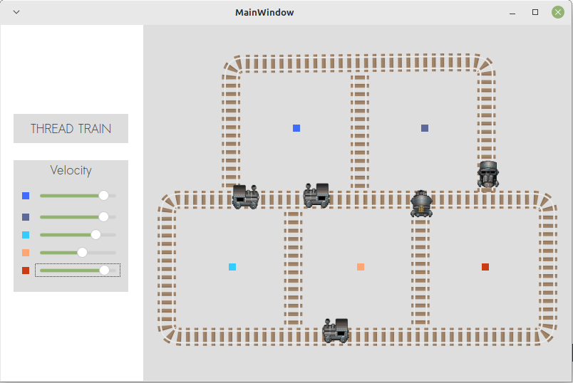

# imd0036-SO-atv-2
Segunda atividade avaliativa da disciplina de Sistemas Operacionais 2022.2

    </img>
    </img>

## Atenção! Instruções para rodar o projeto
Tendo em vista que foi utilizado texturas/sprites para representar os trilhos e os trains visualmente, é necessário configurar para que o mesmo funcione corretamente. Para isto, basta seguir as seguintes instruções:

</img>

Por padrão essa configuração ja existe, porém caso não exista, basta adicionar as variaveis de ambiente o variavel `PWD` com o seu valor como `/home/{usuario_maquina}/{pasta_raiz_projeto_projeto}` parecido com o exemplo acima.

### Qualquer dúvida, contatar em:
<ul> 
    <li>
        <a>allefmiller@hotmail.com</a>
    </li>
    <li>
        <a>allef.miller.135@ufrn.edu.br</a>
    </li>
</ul>
